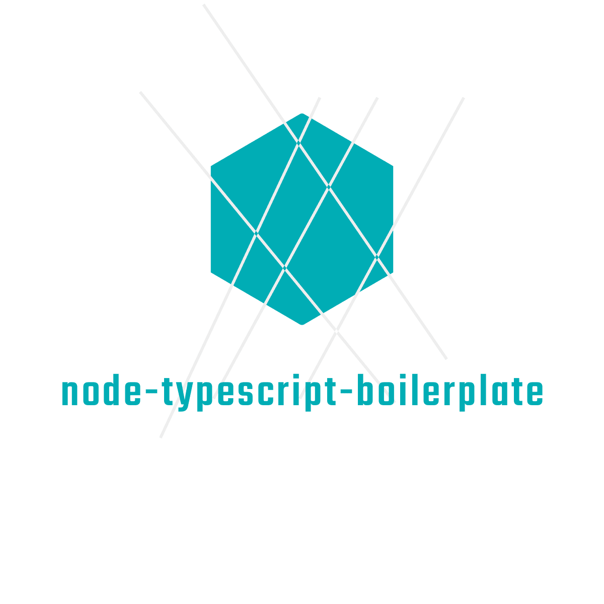

<div align="center">
  
</div>

[](https://github.com/gabrielsanttana/node-typescript-boilerplate/blob/master/LICENSE) 
[](https://github.com/gabrielsanttana/node-typescript-boilerplate/blob/main/CONTRIBUTING.md)

<p align="center">🧬 A boilerplate for Node.js APIs with TypeScript set up</p>

## 🛠️ Technologies

<ul>
  <li><a href="https://nodejs.org/en/docs/">Node.js</a></li>
  <li><a href="https://www.typescriptlang.org/">TypeScript</a></li>
  <li><a href="https://github.com/expressjs/express">Express</a></li>
</ul>

## ⚙️ Requirements

<ul>
  <li><a href="https://git-scm.com/">Git</a></li>
  <li><a href="https://nodejs.org/en/">Node.js</a></li>
  <li><a href="https://www.npmjs.com/">NPM</a></li>
</ul>
</ul>

## 🚀 Installation

```bash
$ git clone https://github.com/gabrielsanttana/node-typescript-template
$ cd node-typescript-template
$ npm install

# Then, you're ready to go and start adding new endpoints to your API!
```

## 💁🏽 Contribute

Your contribution is always welcome!

Check out the [contribution guideline](https://github.com/gabrielsanttana/node-typescript-boilerplate/blob/main/CONTRIBUTING.md).

## ⚖️ License

[MIT License](https://github.com/gabrielsanttana/node-typescript-boilerplate/blob/main/LICENSE)
